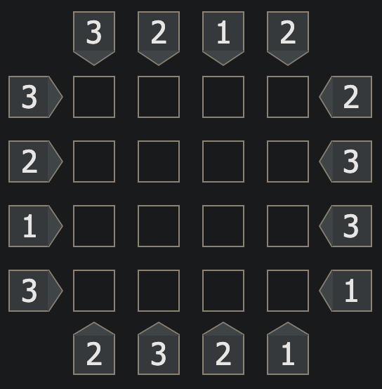
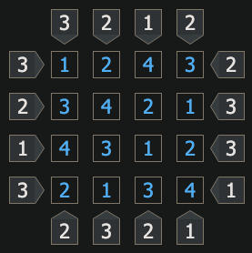
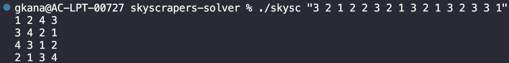

# Skyscrapers puzzle solver

This is a code created to solve the Skyscrapers Puzzle, it was made during the **42 piscine** where I was learning the basics of **C language**. I'll try to make this README the more explanatory and detailed as possible, so I can show what was the logic used to solve this problem, and the main point to study with this project.

## What is the Skyscrapers Puzzle?
This is a logic-based game, where players fill in a grid with skyscrapers of varying heights, based on certain visibility rules. The puzzle challenges your ability to think critically and make deductions to complete the grid accurately.

### Game setup and rules
* The grid is usually square (e.g., 4x4, 5x5, or 6x6). In the case of this code, it can only solve boards from **4x4 to 6x6**.
* The numbers along the edges of the grid indicate how many skyscrapers you can see from that direction. That means if you have a **1** in some edge, the skyscraper to be placed next to it is a **4 height skyscraper**, because the 1 means you can only see 1 skyscraper in this point of view. If you see a **4** in some edge that means you need to place the skyscrapers in ascending order in this line/column **(1, 2, 3, 4)**, because the 4 means you can see 4 skyscrapers from this point of view.
* Each cell within the grid must contain a skyscraper of a **unique height** from 1 to N, where N is the size of the grid (e.g., in a 4x4 grid, each row and column will have skyscrapers with heights 1, 2, 3, and 4). And you **cannot** repeat a skyscraper of the same height in the same line or column.

#### This is an empty board to help illustrate the initial setup.


#### This is the same board but filled with the correct answer.


Note that it doesn't have **repeated** numbers in the same line or columns and all point of views are correctly **satisfied**.

## The Backtracking Algorithmn
To solve this puzzle it was used the [Backtracking algorithmn](https://en.wikipedia.org/wiki/Backtracking), it is a **recursive algorithm** used to solve constraint satisfaction problems, such as (Sudoku, Skyscrapers, Maze, etc.) or combinatorial problems, by exploring **all potential solutions** and abandoning solutions that violate the problem's constraints (known as backtracking). It systematically searches for a solution by attempting partial solutions and "backtracking" when a conflict or dead-end is encountered.

In our case the constrainsts are simple:
* Not repeating numbers in the same line or column;
* Respecting the given numbers of point of views.

## Project Structure

* `include/`: This folder is used to store all header files created to reuse functions from one file into another. Each file has it's own header file.
* `src/`: This folder is used to store all source code created in this project, here is the logic of how to solve the puzzle.
* `Makefile`: This file is used to help compiling the code and I also created some make commands to help testing the code.

## Code explanation
The main logic to solve the puzzle is inside the `src/choice.c` file, because here is where the code make "it's choice" of which number it will try to put in the board. 

```c
int     solve(int input_constraints[SIZE][SIZE], int board[SIZE][SIZE], int row, int col)
{
	int	num;

	// Here we have our base cases, that means our conditions to know when we have filled
	// each row, which is when we reach the last column of each row (If we reached the last
	// column, it will try the next row in the first column). And when we have filled
	// the whole board, which is we reached the last row (Then the answer was found).
	if (row == SIZE)   // Satified the last row, answer found.
		return (1);
	if (col == SIZE)   // Satified the last column of the row, go to the next row and first column
		return (solve(input_constraints, board, row + 1, 0) == 1);
	
	// Here the code will make it's choice, a number from 1 to 4 and will put it into the board
	// and check if this choice will satisfy all constraints.
	num = 1;
	while (num <= SIZE)
	{
		board[row][col] = num;  // Insert the number into the board
		// If the choice is valid (satisfies all constraints),
		// it will now try to fill the next slot in the same row
		if (is_valid_choice(input_constraints, board, row, col) == 1)
		{
			if (solve(input_constraints, board, row, col + 1) == 1)
				return (1);
		}
		num++;
	}
	// If the code runs out of choice, no number satisfies the constraints, it will put zero (backtrack) into
	// the board, and will return false to the previous choice made. 
	board[row][col] = 0;
	return (0);
}
```

## Code execution
### Choosing board size
You can change the board size by modifying the variable `SIZE` inside the `include/values.h` header file, this code can easily solve boards from **4x4 to 6x6**, boards bigger than this can take a very long time to run.

```c
# define SIZE 4
```

The default value for the board is 4, it is already set in the code.

### Compiling and testing
To help compiling the code you can use the `Makefile` which have some commands to compile, clean and run the code. You can compile it by running:

```sh
make fclean
make
```

The `fclean` command will remove all generated binaries if you already compiled the code before, because you cannot compile it with another generated binary with the same name inside the folder. Then the command `make` will compile the source code and will generate a binary called `skysc`.

After this you can run the program by executing the `skysc` file and passing the constraint numbers in the first argument.

```sh
./skysc "4 3 2 1 1 2 2 2 4 3 2 1 1 2 2 2"
```

The argument needs to be a **string** containing all numbers needed to solve the board, that means **(board_size * 4) numbers**. (e.g. 16 numbers for a 4x4 board).

The output should look like this:



To help you test the program, I already set up some `make` commands for 4x4, 5x5 and 6x6 boards. You can use it by executing:

```sh
make run4
make run5
make run6
```

Just be aware to execute only the command that runs the test of the configured board size, if it's a 4x4 board, execute the `make run4` command.

## Credits
This project was only possible specially because of [this video](https://www.youtube.com/watch?v=Zq4upTEaQyM&ab_channel=BackToBackSWE), and many others from the [Back to Back SWE](https://www.youtube.com/@BackToBackSWE) youtube channel. Thank you so much!!